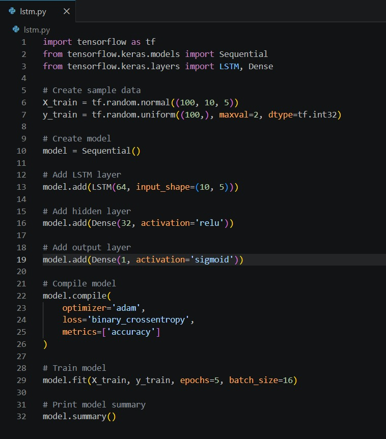
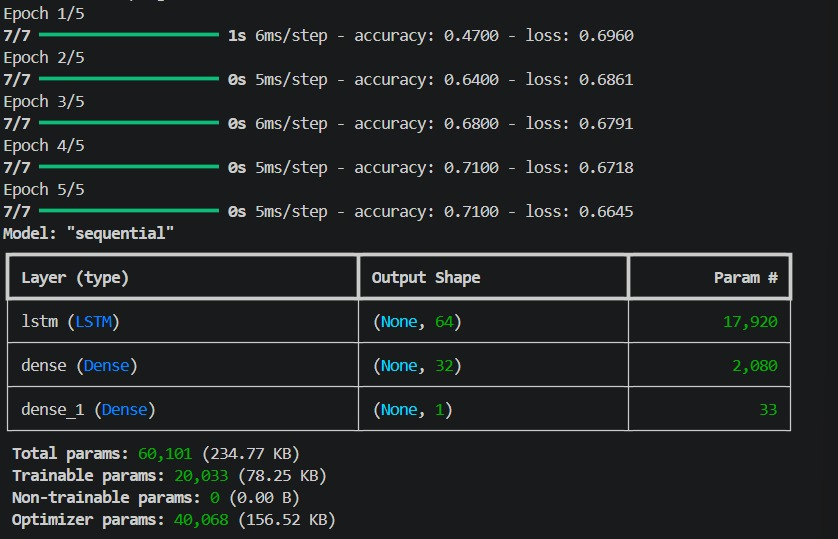
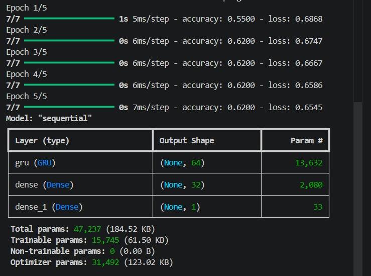

# 🧠 TensorFlow RNN Models (LSTM & GRU)

Implementation and comparison of **Long Short-Term Memory (LSTM)** and **Gated Recurrent Unit (GRU)** models using **TensorFlow** and **Keras**.

---

## 📌 Overview

This project demonstrates the implementation of two popular Recurrent Neural Network (RNN) architectures:

- 🔹 Long Short-Term Memory (LSTM)
- 🔹 Gated Recurrent Unit (GRU)

The objective of this project is to understand how these models are built, trained, and compared using TensorFlow and Keras.

---

## 🚀 Tech Stack

- Python
- TensorFlow
- Keras
- NumPy

---

## 📂 Repository Structure

```text
tensorflow-rnn-models/

├── code/
│   ├── lstm.py
│   └── gru.py
│
├── images/
│   ├── project_overview.jpeg
│   ├── LSTM_code.jpeg
│   ├── LSTM_output.jpeg
│   ├── GRU_code.jpeg
│   └── GRU_output.jpeg
│
├── requirements.txt
├── LICENSE
└── README.md
```

---

# 📸 Project Overview

> *(Upload your purple project image as `project_overview.jpeg`.)*


---

# 🧠 LSTM Implementation

### Source Code



### Training Output



---

# 🧠 GRU Implementation

### Source Code


### Training Output



---

## 📊 LSTM vs GRU Comparison

| Feature | LSTM | GRU |
|---------|------|------|
| Gates | 3 (Input, Forget, Output) | 2 (Reset, Update) |
| Memory Cell | Yes | No |
| Parameters | Higher | Lower |
| Training Speed | Slower | Faster |
| Complexity | Higher | Lower |

---

## 💡 Key Learnings

- Implemented LSTM and GRU models using TensorFlow/Keras.
- Understood sequence modeling with recurrent neural networks.
- Compared the architecture and parameter count of both models.
- Learned the workflow of building, compiling, training, and evaluating deep learning models.

---

## ▶️ Installation

Clone the repository:

```bash
git clone https://github.com/palakgupta5060/tensorflow-rnn-models.git
```

Install the required packages:

```bash
pip install -r requirements.txt
```

Run the models:

```bash
python code/lstm.py
python code/gru.py
```

---

## ⚠️ Note

This project uses **synthetically generated sample data** to demonstrate the implementation of LSTM and GRU models. It is intended for educational purposes and can be extended to real-world sequence datasets such as time-series forecasting or text classification.

---

## 🚀 Future Improvements

- Train on real-world datasets.
- Perform hyperparameter tuning.
- Add performance visualization.
- Compare additional RNN architectures.
- Build an interactive demo using Streamlit.

---

## 👩‍💻 Author

**Palak Gupta**

B.Tech – Electronics & Computer Engineering

Interests: Artificial Intelligence • Machine Learning • Generative AI • Large Language Models (LLMs)

